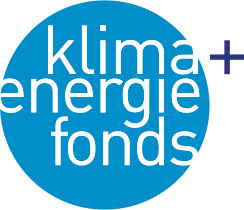

# Nomenclature & style guides for the *netzero2040* project

© 2021 NetZero2040 consortium; licensed under the [MIT License](LICENSE).

## Overview

This repository contains tools and specifications for the **NetZero2040** project.

## Content

### Definitions

The folder [definitions](definitions) has the common codelists for variables, units,
and regions to be used in this project.
The structure follows the conventions of the **nomenclature** package.

This package facilitates working with data templates that follow the
format developed by the Integrated Assessment Modeling Consortium (IAMC).
It supports validation of scenario data based on a project-specific configuration.
[Read the docs](https://nomenclature-iamc.readthedocs.io)!

### A common color scheme

The folder [styles](styles) contains a **pyam**-compatible configuration file
with a color scheme to be used in this project.

The Python package **pyam** is an open-source community toolbox
for analysis & visualization of scenario data.
It was developed to facilitate working with timeseries data
conforming to the format developed by the IAMC,
and it is used in ongoing assessments by the IPCC and in many model comparison
projects at the global and national level, including several Horizon 2020 projects.
[Read the docs](https://pyam-iamc.readthedocs.io)!

## Funding acknowledgement

The **netzero2040** project was funded by the Klimafonds
as part of the 13th Austrian Climate Research Programme (ACRP).  
Grant number KR20AC0K18182.